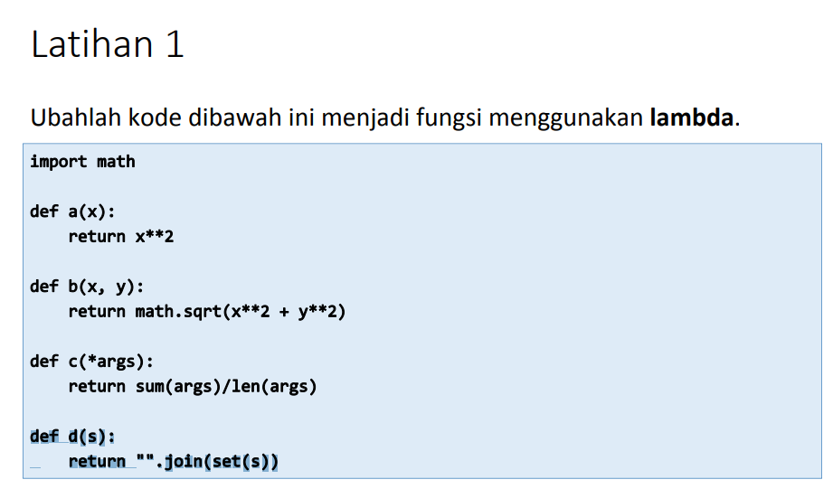
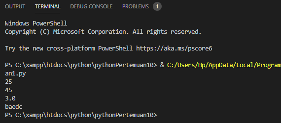
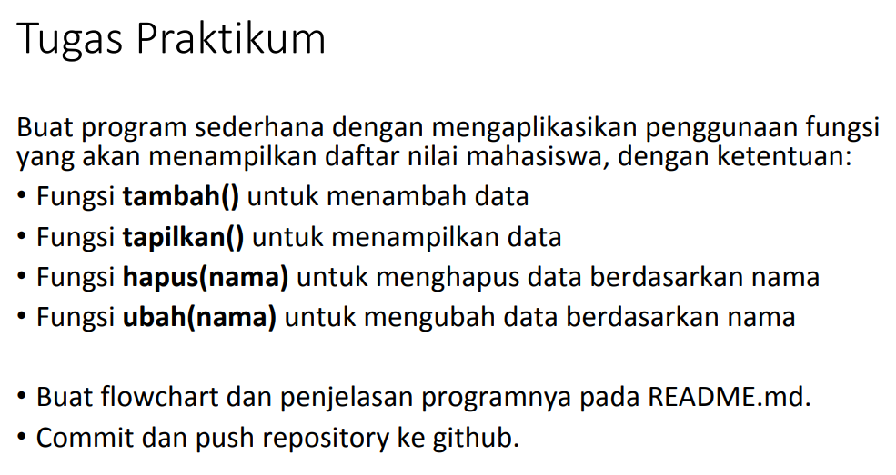
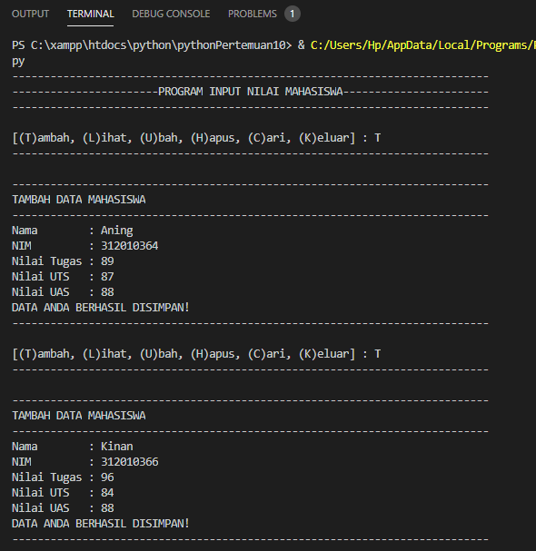
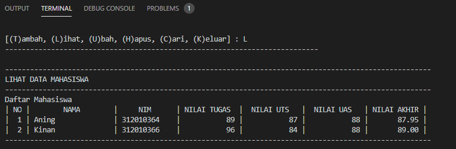
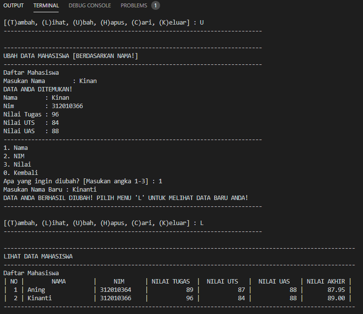
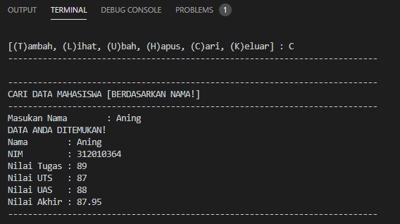
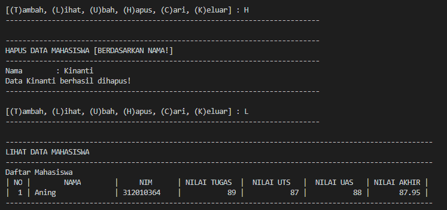

# TUGAS PERTEMUAN 10 DAN PENJELASAN
## MODUL LABS 6
## SUB RUTIN / FUNGSI

**Nama	  : Aning Kinanti** <br>
**Nim	  : 312010364** <br>
**Kelas	  : TI.20.A2** <br>
**Matkul  : Bahasa Pemrograman** <br>


## TUGAS LATIHAN LABS 6
#### SOAL


#### SYNTAX
berikut merupakan syntax untuk menampilkan program diatas

```python
#author aning kinanti

#mengubah def a(x): ke lambda
a = (lambda x: x ** 2)
print(a(5))

#mengunbah def b(x, y): ke lambda
b = (lambda x, y: x**2 + y**2)
print(b(3,6))

#mengubah def c(*args): ke lambda
c = (lambda *args: sum(args)/ len(args))
print(c(3)) 

#mengubah def d(s): ke lambda
d = (lambda s: "".join(set(s)))
print(d("abcde"))
```

#### OUTPUT
Dibawah ini merupakan hasil output dari syntax diatas



#### ANALISIS
•	Belum

## TUGAS PRAKTIKUM 

#### SOAL


#### SYNTAX
berikut merupakan syntax untuk menampilkan program diatas

```python
#author aning kinanti
print(95*"=")
```

#### OUTPUT
Dibawah ini merupakan hasil output dari syntax diatas:

##### OUTPUT MENU TAMBAH
 <br>
•	User akan diminta memilih menu, pertama silahkan pilih menu tambah (T)/(t). <br>
•	Maka program akan berjalan seperti pada gambar diatas. Disini saya mencoba menambahkan 2 data mahasiswa. <br>

##### OUTPUT MENU LIHAT
 <br>
•	User dapat melihat data yang telah ditambahkan, dengan memilih menu lihat (L)/(l). <br>
•	Maka program akan menampilkan data yang telah ditambahkan seperti pada gambar diatas. <br>

##### OUTPUT MENU UBAH
 <br>
•	User dapat mengubah data yang telah diinput, dengan memilih menu ubah (U)/(u). <br>
•	User akan diminta memasukan data nama mahasiswa yang akan diubah. <br>
•	Kemudian apabila data tersebut ditemukan, program akan menampilkan data lengkap mahasiswa tersebut. <br>
•	Lalu program akan memberikan pilihan kepada user data apa yang akan diubah. <br>
•	Maka program akan menampilkan data yang telah ditambahkan seperti pada gambar diatas. <br>
•	Seperti pada gambar diatas saya mencoba mengubah data Nama Kinan menjadi Kinanti. <br>
•	Lalu user dapat mengecek kembali data yang telah diubah dengan menu lihat. <br>

##### OUTPUT MENU CARI
 <br>
•	User dapat mencari data mahasiswa berdasarkan nama, dengan memilih menu cari (C)/(c). <br>
•	User akan diminta memasukan data nama mahasiswa yang akan dicari. <br>
•	Kemudian apabila data tersebut ditemukan, program akan menampilkan data lengkap mahasiswa tersebut. <br>

##### OUTPUT MENU HAPUS
 <br>
•	User dapat menghapus data mahasiswa berdasarkan nama, dengan memilih menu hapus (H)/(h). <br>
•	User akan diminta memasukan data nama mahasiswa yang akan dihapus. <br>

#### ANALISIS
•	Proses input data terjadi pada syntax dibawah ini :

•	Pada statement `dataNilai=[]` berfungsi untuk menyimpan/merangkap data yang akan diinputkan oleh user <br>
•	Pada statement `while True :` berfungsi untuk melakukan proses looping/perulangan. <br>
•	Pada statement `nAkhir = float(nTugas)*30/100+(nUts)*35/100+(nUas)*35/100` diambil dari ketentuan soal untuk proses perhitungan nilai akhir. <br>
•	Pada statement `dataNilai.append ([nama, nim, nTugas, nUts, nUas, nAkhir])` berfungsi menambah element list. <br>
•	Pada statement
